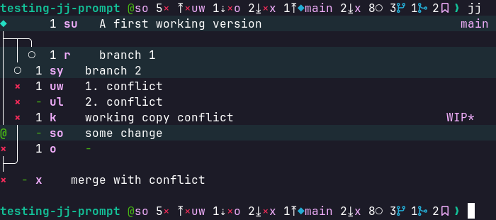

## What it does

Calls `jj log` and creates a prompt from the info.

Shows:
- working copy ID (@) state and stats
- offset and ID of conflicts: first (to @), previous/next to @ and last
- offset and ID w.r.to @-branch of last immutable (main) and last
- number of branches, merges and bookmarks

By default, all prompt sections are shown, with `@` first. Use `-s` or `--show` to select sections; repeat it to choose their output order. Include `@` wherever you want the working copy ID to appear. Unique prefixes are accepted, for example `-s m` selects `main`; ambiguous prefixes are rejected.

```sh
jj-prompt -s conflicts -s branches -s @
```

Available sections are `@`, `stats`, `conflicts`, `branches`, `main`, `last-change`, and `counts`.



## Install

Add it to your starship config.

```toml
format = "[$directory${custom.jj-prompt}]($style)$character"

[custom.jj-prompt]
when = "jj root --ignore-working-copy --quiet"
format = "$output "
shell = "jj-prompt"
ignore_timeout = true
```
